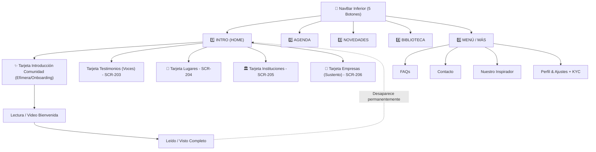
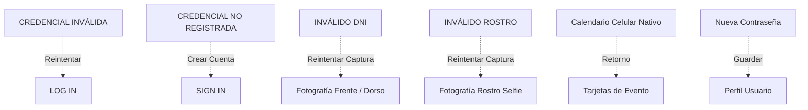

# Reporte de Replicación y Mejoras del UX User Flow: FEELING APP

Se ha procesado y analizado minuciosamente la imagen **[FEELING APP.jpg](file:///c:/Users/Demian/Documents/UX-UI/FEELING%20APP/FEELING%20APP.jpg)**. Se replicó el 100% de la estructura de nodos, sub-listas de ítems, conexiones y codificación de colores, asegurando la continuidad total sin nodos huérfanos o callejones sin salida.

---

## 📱 Estructura Actualizada de la NavBar Inferior Persistente (5 Botones)

- 1️⃣ **INTRO (HOME APP)**: Aloja **5 Tarjetas Iniciales (Directorios Independientes)**:
  - **`Tarjeta 1: TARJETA INTRODUCCIÓN A LA COMUNIDAD (EFÍMERA / ONBOARDING)`**: Muestra contenido visual de bienvenida y presentación de la comunidad. Una vez leída y vista por completo, **desaparece permanentemente** de la pantalla Intro.
  - **`Tarjeta 2: TESTIMONIOS (VOCES)`**: Acceso al directorio de testimonios -> Media Pool (`SCR-203`).
  - **`Tarjeta 3: LUGARES`**: Acceso al directorio de lugares -> Media Pool (`SCR-204`).
  - **`Tarjeta 4: INSTITUCIONES`**: Acceso al directorio de instituciones -> Media Pool (`SCR-205`).
  - **`Tarjeta 5: EMPRESAS (SUSTENTO)`**: Acceso al directorio de empresas (36 ítems) -> Media Pool (`SCR-206`).

- 2️⃣ **AGENDA**: Pestañas *Próximo* y *Calendario* -> Tarjeta de Evento Unificada (Doble Botón: *Registrarse* + *Agendar*).
- 3️⃣ **NOVEDADES**: Historias Efímeras 24h.
- 4️⃣ **BIBLIOTECA**: Streaming de Música, Documentales, Podcasts y Cancionero (Con opción de reproducción con/sin conexión).
- 5️⃣ **MENÚ / MÁS**: FAQs, Contacto, Nuestro Inspirador, Perfil & Ajustes + Verificación KYC.

---

## 🔗 Auditoría Completa de Conectores y Bucle de Retorno (Loop Closure)

Se han añadido y verificado todos los **conectores de retorno y recuperación de errores** para garantizar que ningún flujo quede "colgado" o sin salida:

---

## 📁 Archivos Editables del Proyecto en `User Flow/`

1. 🌐 **[index.html](file:///c:/Users/Demian/Documents/UX-UI/FEELING%20APP/User%20Flow/index.html)**: Editor visual interactivo.
2. 📊 **[user_flow.mmd](file:///c:/Users/Demian/Documents/UX-UI/FEELING%20APP/User%20Flow/user_flow.mmd)**: Sintaxis Mermaid completa.
3. 📄 **[user_flow_data.json](file:///c:/Users/Demian/Documents/UX-UI/FEELING%20APP/User%20Flow/User_flow_data.json)**: JSON estructurado.
4. 🏷️ **[CODIFICACION_PANTALLAS.md](file:///c:/Users/Demian/Documents/UX-UI/FEELING%20APP/User%20Flow/CODIFICACION_PANTALLAS.md)**: Índice oficial de pantallas y mapeo a diseños.
